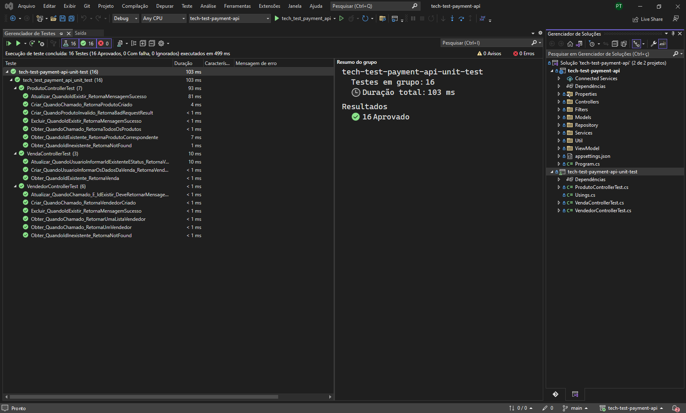
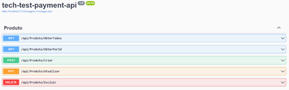
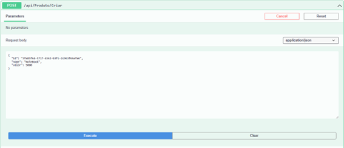
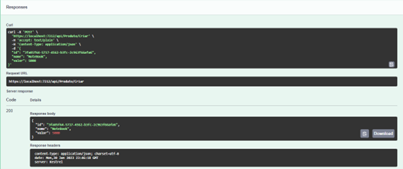
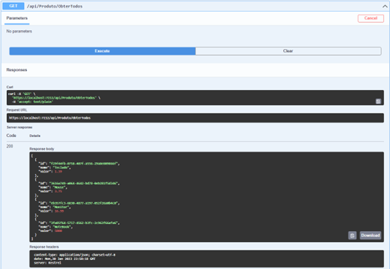
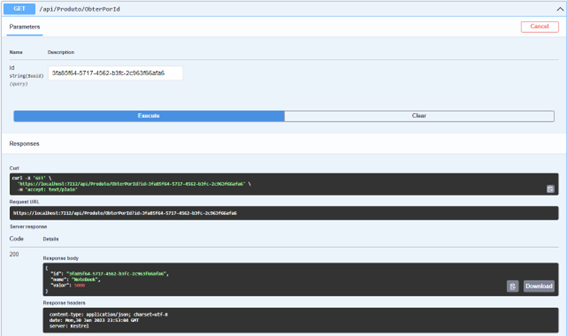
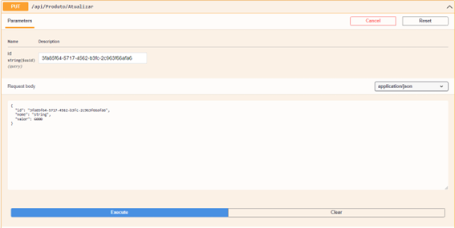
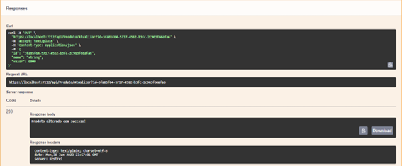
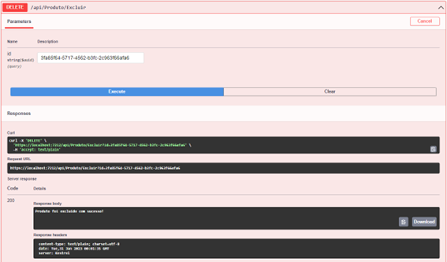

## INSTRUÇÕES PARA O TESTE TÉCNICO

-   Crie um fork deste projeto (https://gitlab.com/Pottencial/tech-test-payment-api/-/forks/new). É preciso estar logado na sua conta Gitlab;
-   Adicione @Pottencial (Pottencial Seguradora) como membro do seu fork. Você pode fazer isto em https://gitlab.com/`your-user`/tech-test-payment-api/settings/members;
-   Quando você começar, faça um commit vazio com a mensagem "Iniciando o teste de tecnologia" e quando terminar, faça o commit com uma mensagem "Finalizado o teste de tecnologia";
-   Commit após cada ciclo de refatoração pelo menos;
-   Não use branches;
-   Você deve prover evidências suficientes de que sua solução está completa indicando, no mínimo, que ela funciona;

## O TESTE

-   Construir uma API REST utilizando .Net Core, Java ou NodeJs (com Typescript);
-   A API deve expor uma rota com documentação swagger (http://.../api-docs).
-   A API deve possuir 3 operações:
    1. Registrar venda: Recebe os dados do vendedor + itens vendidos. Registra venda com status "Aguardando pagamento";
    2. Buscar venda: Busca pelo Id da venda;
    3. Atualizar venda: Permite que seja atualizado o status da venda.
        - OBS.: Possíveis status: `Pagamento aprovado` | `Enviado para transportadora` | `Entregue` | `Cancelada`.
-   Uma venda contém informação sobre o vendedor que a efetivou, data, identificador do pedido e os itens que foram vendidos;
-   O vendedor deve possuir id, cpf, nome, e-mail e telefone;
-   A inclusão de uma venda deve possuir pelo menos 1 item;
-   A atualização de status deve permitir somente as seguintes transições:
    -   De: `Aguardando pagamento` Para: `Pagamento Aprovado`
    -   De: `Aguardando pagamento` Para: `Cancelada`
    -   De: `Pagamento Aprovado` Para: `Enviado para Transportadora`
    -   De: `Pagamento Aprovado` Para: `Cancelada`
    -   De: `Enviado para Transportador`. Para: `Entregue`
-   A API não precisa ter mecanismos de autenticação/autorização;
-   A aplicação não precisa implementar os mecanismos de persistência em um banco de dados, eles podem ser persistidos "em memória".

## PONTOS QUE SERÃO AVALIADOS

-   Arquitetura da aplicação - embora não existam muitos requisitos de negócio, iremos avaliar como o projeto foi estruturada, bem como camadas e suas responsabilidades;
-   Programação orientada a objetos;
-   Boas práticas e princípios como SOLID, DDD (opcional), DRY, KISS;
-   Testes unitários;
-   Uso correto do padrão REST;

## Evidências de funcionamento

   <h1> Teste unitário <h1/>
     
    
     

   <h1> Swagger Produto <h1/>
     
    

-   <h2> Request do método Criar <h2/>
     
    

-   <h2> Response do método Criar <h2/>
     
    

-   <h2> Request e Response do método ObterTodos <h2/>
     
    

-   <h2> Request e Response do método ObterPorId <h2/>
     
    

-   <h2> Request do método Atualizar <h2/>
     
    

-   <h2> Response do método Atualizar <h2/>
     
    

-   <h2> Request e Response do método Excluir <h2/>
     
    
     
     

   <h1> Swagger Vendedor </h1>
     
    

-   <h2> Request e Response Obter todos<h2/>
    
     

-   <h2> Request e Response Obter por Id<h2/>
     
    

-   <h2> Request e Response Criar<h2/>
     
    

-   <h2> Request e Response Atualizar<h2/>
     
    

-   <h2> Request e Response Excluir<h2/>
     
    
